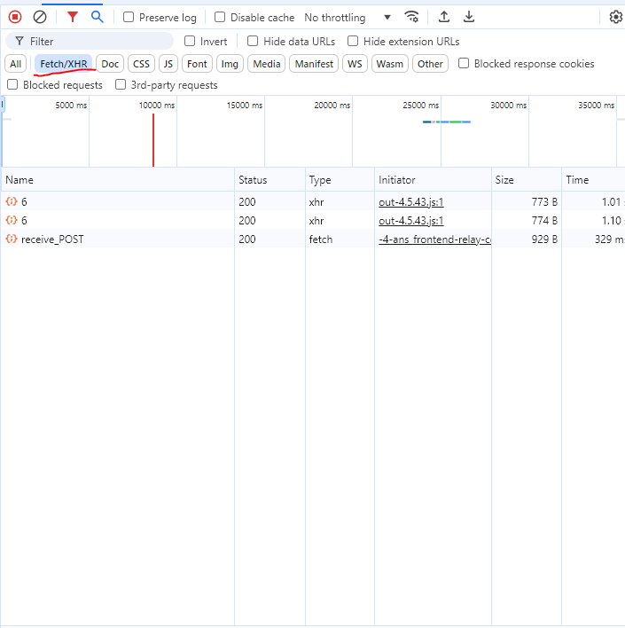
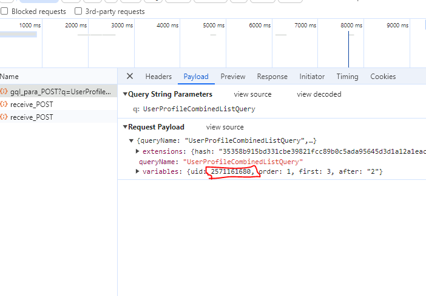

## Description
this script can be used to load quora profiles answers links and save them as json file
## Instalation
first run ``pip install -r requirements.txt`` then excute command ``python app.py profile uid``
## finding quora profile and id
to find is of quora profile follow those steps  
1- go to user profile and open inspect tool  
2- go to the network and chose Fetch/XHR  
  
3- scroll down on the quora page you will see new request sent to load more content click the request  
4- go to playload you will find the uid there (the profile id)  
